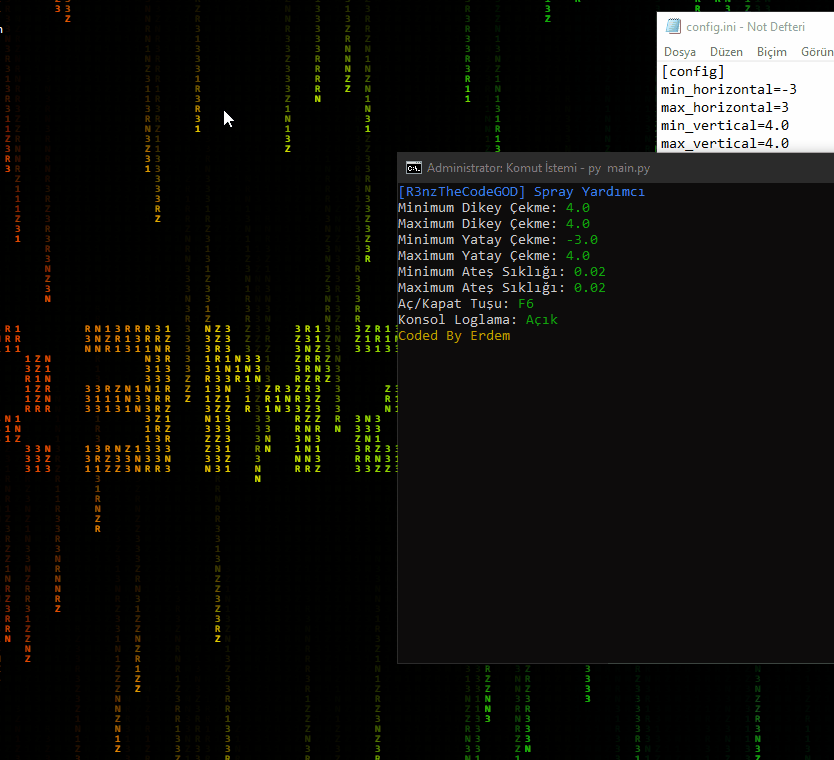

# R3nzTheCodeGOD Recoil Helper
This program is the program that helps weapon recoil in games, this program can be configured for each game.

## Usage
- Clone repo `git clone https://github.com/R3nzTheCodeGOD/Recoil-Helper` or [download](https://github.com/R3nzTheCodeGOD/Recoil-Helper/releases) compiled version 
- if you downloaded compiled click and run
- If you downloaded the source code, run it by typing py main.py Note: [python](https://www.python.org) is required

## Config.ini setup
- `min_horizontal` minimum horizontal value that can be shifted -> required value negative integer or 0
- `max_horizontal` maximum horizontal value that can be shifted -> required value positive integer or 0
- `min_vertical` minimum vertical value that can be shifted -> required value positive integer
- `max_vertical` maximum vertical value that can be shifted -> required value positive integer
- `min_firerate` minimum firerate -> required value float. Example 0.02
- `max_firerate` maximum firerate -> required value float. Example 0.03
- `toggle_key` cheat toggle key. Example insert
- `log` mouse records are printed on the screen -> True or False

- `lang` Select language en_Us:English or tr_TR:Turkish

